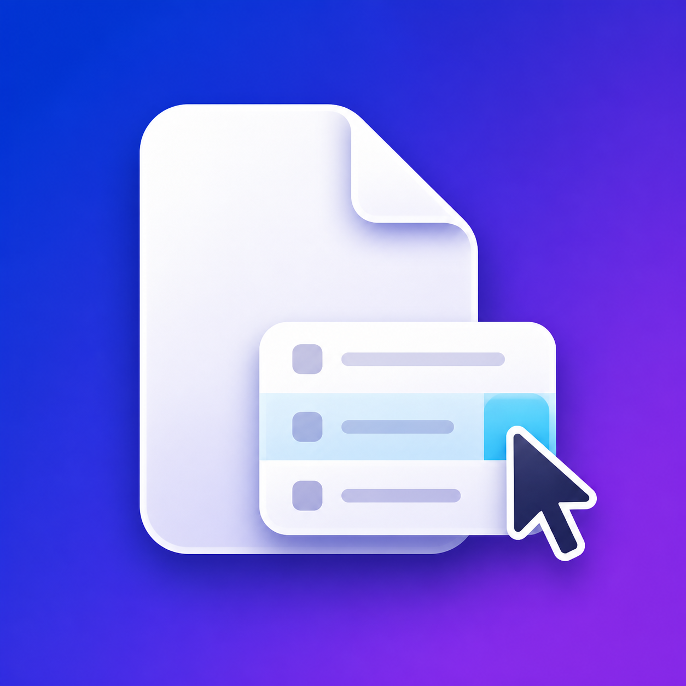

<p align="center">
  
</p>

<h1 align="center">BlankRightKit</h1>

<p align="center">免费、开源、原生的 macOS Finder 右键工具箱。</p>

<p align="center">
  
  
  <a href="LICENSE"></a>
</p>

<p align="center">
  简体中文 · <a href="README.en.md">English</a> ·
  <a href="docs/SETUP.zh-CN.md">安装</a> ·
  <a href="ROADMAP.md">路线图</a> ·
  <a href="CONTRIBUTING.md">参与贡献</a>
</p>

> [!IMPORTANT]
> `0.1.0` 是面向源码构建和本机自用的 MVP。当前 Finder 扩展使用开发签名及临时文件权限例外，不应把个人开发证书签名的 App 当作公开发行包上传。公开分发前需要重新设计权限并完成 Developer ID 签名、公证和发布测试。

BlankRightKit 使用 Apple 的 Finder Sync API，不注入 Finder，不执行任意 Shell 脚本，不依赖云服务，也不包含账号、广告或遥测。

## 功能

| 类别 | 功能 |
|---|---|
| 新建 | 文本、Markdown、JSON、文件夹；自动选择无冲突名称，不覆盖已有文件 |
| 路径 | 复制完整路径、文件名、可粘贴到 Shell 的安全转义路径 |
| 打开方式 | Terminal、iTerm2、Ghostty、Visual Studio Code、Cursor、Zed、Xcode |
| 校验 | 流式计算一个或多个文件的 SHA-256 |
| 图片 | 将常见图片转换为 PNG 或 JPEG，不覆盖源文件 |
| 菜单 | 每项功能独立开关；默认收进 `BlankRightKit` 折叠菜单，也可切换为扁平菜单 |
| 模板 | 配置新建文件的默认名称、扩展名和初始内容 |
| 诊断 | 在扩展容器中记录菜单、点击、目标路径和动作结果，不上传 |

## 快速开始

### 环境要求

- macOS 13 Ventura 或更新版本
- Xcode 16 或更新版本
- [XcodeGen](https://github.com/yonaskolb/XcodeGen) 2.43 或更新版本
- 本机运行 Finder 扩展需要免费 Apple ID 对应的 Xcode Personal Team

### 获取源码并测试

```sh
git clone <your-fork-url>
cd BlankRightKit
brew install xcodegen
make project
swift test
open BlankRightKit.xcodeproj
```

### 本机签名构建

先在 Xcode 的 `Settings → Accounts` 登录 Apple ID。将 `<YOUR_TEAM_ID>` 替换为 Personal Team 的 Team ID：

```sh
DEVELOPER_DIR=/Applications/Xcode.app/Contents/Developer xcodebuild \
  -project BlankRightKit.xcodeproj \
  -scheme BlankRightKit \
  -configuration Release \
  -derivedDataPath SignedDerivedData \
  -allowProvisioningUpdates \
  DEVELOPMENT_TEAM=<YOUR_TEAM_ID> \
  CODE_SIGN_STYLE=Automatic \
  build
```

完整安装、升级、扩展注册和诊断步骤见 [Xcode 与开发环境说明](docs/SETUP.zh-CN.md)。不要用 `Sign to Run Locally` / ad hoc 签名安装 Finder 扩展；当前 macOS 会拒绝加载这种扩展。

## 权限与隐私

- App 与 Finder 扩展都保持 App Sandbox。
- 自用扩展包含 `com.apple.security.temporary-exception.files.absolute-path.read-write = /`，让原生动作沿用当前登录用户本来拥有的文件权限。
- 该例外不是 root 或提权，不能绕过 POSIX/ACL、SIP 或 macOS 隐私控制（TCC）。
- 项目不申请网络权限，不上传日志，不执行复制出的 Shell 路径。
- 新建与图片转换始终使用无冲突输出名。

详细威胁边界见 [SECURITY.md](SECURITY.md) 和 [架构说明](docs/ARCHITECTURE.md)。

## 项目结构

```text
App/                       SwiftUI 设置应用
FinderExtension/           Finder Sync 扩展、菜单桥接和本地诊断日志
Shared/Sources/            可测试的核心模型和原生文件动作
Tests/                     Swift Testing 单元测试
Resources/                 App 图标与资源目录
docs/                      调研、架构、安装和发布文档
.github/                   CI、Issue 表单和 PR 模板
project.yml                XcodeGen 工程真源
BlankRightKit.xcodeproj/   已生成并提交的共享 Xcode 工程
```

## 开发

```sh
make project   # 根据 project.yml 重新生成 Xcode 工程
make test      # 运行核心单元测试
make build     # 执行不签名的 Debug App 构建
```

修改 `project.yml` 后必须重新运行 `make project` 并提交生成后的 `.xcodeproj`。当前测试覆盖菜单规划、设置持久化、唯一命名、模板、Shell 转义、SHA-256 和图片转换。

## 文档

- [市场与技术调研](docs/RESEARCH.zh-CN.md)
- [架构与安全边界](docs/ARCHITECTURE.md)
- [Xcode、签名、安装与诊断](docs/SETUP.zh-CN.md)
- [GitHub 公开仓库发布清单](docs/PUBLISHING.zh-CN.md)
- [版本记录](CHANGELOG.md)
- [路线图](ROADMAP.md)

## 参与贡献

欢迎提交可复现的 Bug、功能提案和 Pull Request。开始前请阅读 [贡献指南](CONTRIBUTING.md)、[行为准则](CODE_OF_CONDUCT.md) 和 [支持说明](SUPPORT.md)。涉及文件破坏、权限绕过或隐私泄露的问题，请按 [安全策略](SECURITY.md) 私下报告。

## 已知限制

- Finder Sync 最初面向同步软件；File Provider、iCloud Drive 或其他扩展可能影响菜单显示。
- macOS 15.0/15.1 的 Finder 扩展管理界面存在系统问题，建议使用 15.2 或更高版本。
- SHA-256 和图片转换仍由扩展进程发起；超大文件的后台队列、取消和进度属于后续工作。
- 当前尚无面向公众的 Developer ID 签名、公证和自动更新发行渠道。

## License

BlankRightKit 以 [MIT License](LICENSE) 开源。
